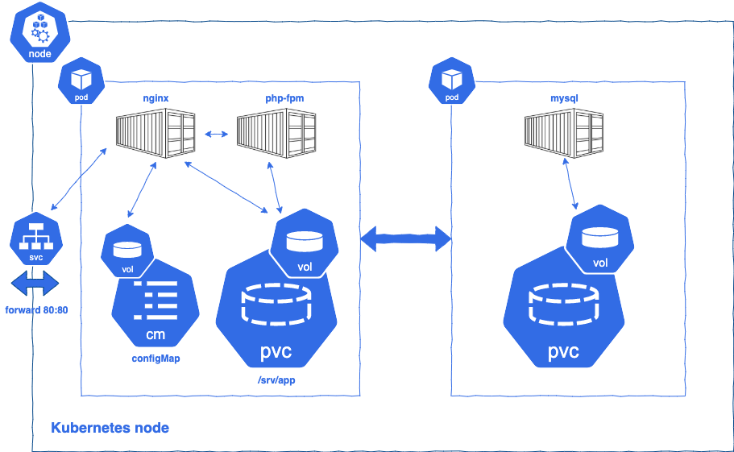

## Overview
The app pod starts two containers: one with nginx and another one with php-fpm. The containers share a persistent volume claim to host the web application source code. Another volume hosts the nginx configuration through the use of a configMap.


## Configuration
* create secret.yaml with the DB and app credentials
```
apiVersion: v1
kind: Secret
metadata:
  name: db-secret
stringData:
  MYSQL_USER: <<user>>
  MYSQL_PASSWORD: <<password>>
---
apiVersion: v1
kind: Secret
metadata:
  name: app-secret
stringData:
  ADMIN_PASSWORD: <<admin-password>>
```
* `app-deployment.yaml`
  * template for the app pod
  * enviroment variables are set via `configmap-app.yaml`
  * requires `MYSQL_USER` and `MYSQL_PASSWORD` defined in db-secret
  * volume mount with path `/var/www/html`
  * container port 80

## Deployment
* use `${PROJECT_DIR}/myCIscript.sh` to apply the configuration and deploy application
* to access the app  `kubectl port-forward <app-pod-id> 8080:80`, the app will be available at `http://localhost`

## Links & Tools
* intensively inspired by https://sergiosicari.medium.com/nginx-php-fpm-and-mysql-on-kubernetes-local-environment-7d01b8e6feae
* extensive guide on migrating Docker Compose to K8 https://www.digitalocean.com/community/tutorials/how-to-migrate-a-docker-compose-workflow-to-kubernetes
* must have https://k9scli.io/